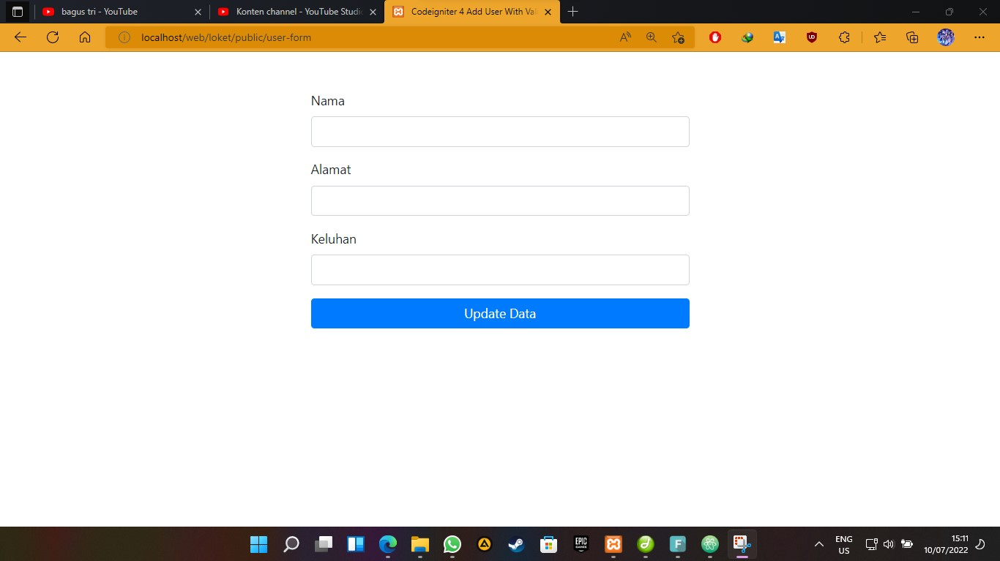

# UASPWeb
#tugas akhirr semester 4 membuat loket antrian
# nama = bagus tri handono
# NIM = 312010170
# kelas = 20.TI.B1
___________________________________________________________________________________________________ 

untuk source code bisa diakses pada github ini 
untuk dokumentasi bisa dilihat melalui video di youtube yang saya buat 
 
===>>[link dokumentasi](https://youtu.be/dS62Eg1lS54)  
===>>[demo web](http://bagustrih-upb.my.id/index) 
 
database table
 
cuplikan tampilan 
 
 
 
 